# vibe-coding-by-Harshit

&gt; Following the trend, this is vibe coding time...

One-file wonders built by vibing with AI: describe → generate → ship.  
Zero boiler-plate, zero build steps—just open and watch.

## Vibe log
| File | One-liner | Run |
|---|---|---|
| `color-game.html` | RGB guessing game with scoreboard | open in browser |
| `3dRealisticEarthRender.html` | spinning 3-D earth with night-lights & atmosphere | open in browser |
| `liquid-glass-ui.html` | Apple-style glass-morphism demo | open in browser |

## How to vibe
1. clone or download any file
2. double-click / `live-server` / drop on Netlify
3. tweak prompt, regenerate, push—keep the vibe alive

## Visual map
